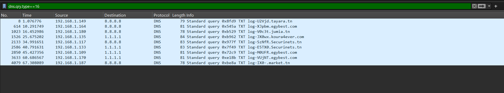

# 🧠 TASK 1 – DNS Exfiltration CTF Write‑Up

**Category:** NETWORK FORENSICS  
**Level:** Meduim  
**Points:** 50
**Author:** H3DD4 

---

## 📜 Challenge

We were given a `capture.pcap` file and told the flag was hidden in the DNS traffic. No hints—just dive in!

---

## 👀 Step 1 – First Look in Wireshark

Opened `capture.pcap` in Wireshark and immediately saw DNS **TXT** queries with weird long strings in the domain names.


Example summary:
192.168.1.149 → 8.8.8.8 DNS Standard query 0x8fd9 TXT log=U2Vj...

yaml
Copier
Modifier
That `log=` plus `U2Vj` is a Base64 clue.

---

## 🔍 Step 2 – Inspect a Suspicious Packet

Followed one of those TXT queries. The full query name was:
log=U2VjdXJpbmV0c3tJX0wxSzNfRE5TX0M0UFRVUjNTIX0=.tayara.tn

yaml
Copier
Modifier


This shows Base64 chunks being smuggled in DNS.

---

## 🎯 Step 3 – Filter Only TXT Queries

Applied this display filter to isolate all exfil packets:
```wireshark
dns.qry.type == 16
(DNS type 16 = TXT)
```

```
Now we have every packet carrying a Base64 fragment.

🧩 Step 4 – Reassemble & Decode
Copy each log= fragment in packet order.

Concatenate into one Base64 string:

makefile
Copier
Modifier
U2VjdXJpbmV0c3tJX0wxSzNfRE5TX0M0UFRVUjNTIX0=
Decode:

bash
Copier
Modifier
echo "U2VjdXJpbmV0c3tJX0wxSzNfRE5TX0M0UFRVUjNTIX0=" | base64 -d
🏁 The Flag
Copier
Modifier
Securinets{I_L1K3_DNS_C4PTUR3S!}
🔑 Takeaways
DNS TXT records can hide data.

Use dns.qry.type == 16 to spot text-based DNS exfiltration.

Look for Base64 in subdomains—DNS isn’t always “just boring”!
